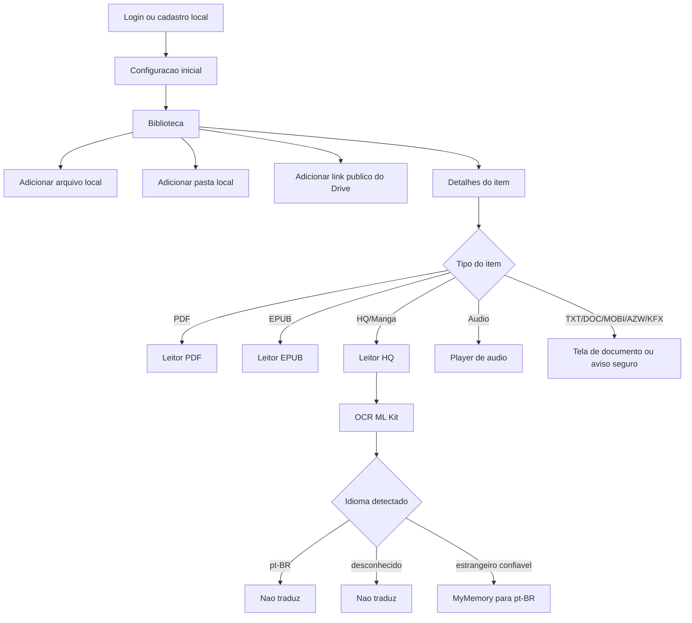
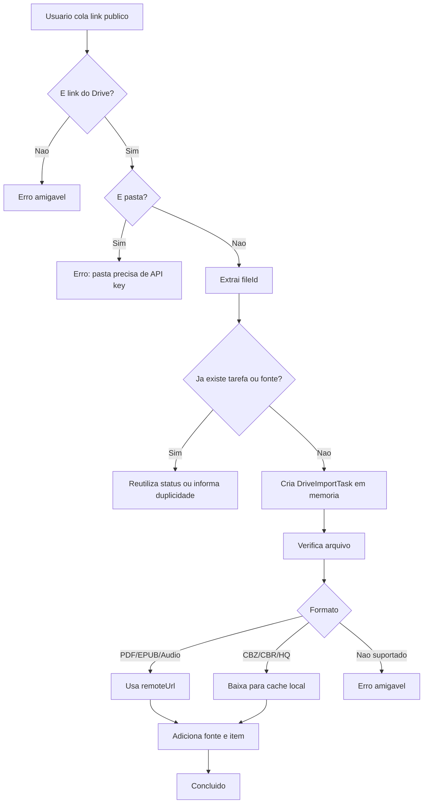
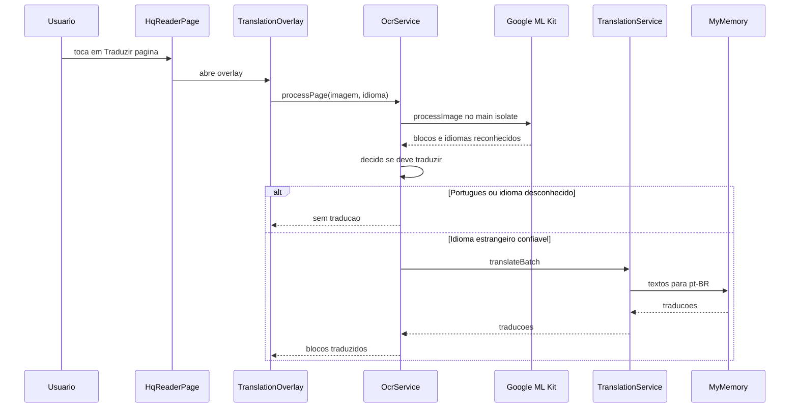

# Minha Estante

<div align="center">
  

  <p><strong>Biblioteca digital pessoal feita em Flutter para organizar, ler e ouvir arquivos locais e links publicos.</strong></p>

  <p>
    
    
    
    
  </p>
</div>

## Visao Geral

O **Minha Estante** e um app de biblioteca pessoal. Ele cataloga arquivos do celular e links publicos do Google Drive, separa a colecao entre itens locais e online, salva progresso de leitura/audio e abre cada tipo de conteudo no leitor mais adequado.

O foco atual e Android real. O projeto tambem possui estrutura padrao Flutter para iOS e Web, mas as partes mais especificas de importacao local, SAF e conversao de CBR foram pensadas principalmente para Android.

## O Que O App Faz

- Organiza biblioteca por itens locais e online.
- Adiciona arquivos avulsos do celular.
- Importa pastas locais usando Storage Access Framework no Android.
- Adiciona links publicos individuais do Google Drive sem API key.
- Rejeita links de pasta do Drive sem API key, porque a listagem segura de pastas publicas exige Drive API.
- Le PDF local ou remoto.
- Le EPUB com leitor interno.
- Le HQ/Manga em CBZ/ZIP e converte CBR/RAR para CBZ quando possivel.
- Executa OCR em paginas de HQ/Manga e traduz texto estrangeiro para pt-BR.
- Reproduz arquivos de audio simples com progresso salvo.
- Salva favoritos, status de leitura e ultimo item aberto.
- Mantem dados localmente com Hive.

## Imagens E Fluxos

Os diagramas abaixo usam Mermaid e renderizam diretamente no GitHub/GitLab. O icone do app usado no topo vem de `web/icons/Icon-192.png`.

### Mapa Geral Do App



### Fluxo De Link Publico Do Google Drive



### Selecao De Leitor

```mermaid
flowchart LR
    A[LibraryItem] --> B{ItemType}
    B -->|pdf| C[/reader/:id]
    B -->|ebook EPUB| D[/epub/:id]
    B -->|ebook MOBI/AZW/KFX| E[/document/:id com aviso]
    B -->|hq| F[/hq/:id]
    B -->|audio| G[/audio/:id]
    B -->|text/document| H[/document/:id]
```

### OCR E Traducao



## Formatos Suportados

| Formato | Entrada atual | Leitura atual | Observacoes |
| --- | --- | --- | --- |
| PDF | Local e Drive publico individual | Sim | Leitor com `pdfrx`, aceita arquivo local e URL remota. |
| EPUB | Local e Drive publico individual | Sim | Leitor interno com `flutter_epub_viewer`, progresso salvo por CFI/progresso. |
| MOBI, AZW, AZW3, KFX | Local e Drive publico individual | Parcial | Entra na estante como ebook, mas deve ser convertido para EPUB para leitura interna. |
| CBZ, ZIP | Local e Drive publico individual | Sim | Extraido em cache e exibido como paginas de imagem. |
| CBR, RAR | Local e Drive publico individual | Sim, quando conversao funciona | Converte para CBZ no cache. Arquivos protegidos por senha, RAR5 ou muito grandes podem exigir conversao manual. |
| CB7, CBT, CBA | Catalogacao local parcial | Limitado | Reconhecidos como HQ em partes do fluxo local, mas leitor/conversor dedicado ainda precisa evoluir. |
| TXT | Local | Sim | Leitura simples com texto selecionavel. |
| DOC, DOCX | Local | Nao | Catalogados com aviso seguro; precisam de leitor dedicado futuro. |
| MP3, M4A, AAC | Local e Drive publico individual | Sim | Player simples com `just_audio` e progresso salvo. |
| M4B, WAV, OPUS | Principalmente Drive publico individual | Parcial | O servico do Drive tenta reconhecer por extensao/MIME; suporte final depende do codec/plataforma e do fluxo de importacao. |

## Como Funciona Por Dentro

### Camadas Principais

```text
lib/
  app/                         Rotas, tema e scaffold principal
  core/
    constants/                 Cores e strings globais
    storage/                   Hive, SAF e resolucao de arquivos
    utils/                     Parsers e formatadores
    widgets/                   Componentes reutilizaveis
  features/
    auth/                      Login/cadastro local e setup inicial
    library/                   Biblioteca, colecoes, progresso e importacao local
    sources/                   Fontes online e links publicos do Drive
    reader/                    PDF, EPUB, HQ, OCR e traducao
    audio/                     Player de audio
    book_detail/               Tela de detalhes e acao principal
    profile/                   Perfil e configuracoes
```

### Estado E Persistencia

- **Riverpod** controla estado de telas, biblioteca, fontes e tarefas em memoria.
- **Hive** salva usuarios locais, itens da biblioteca, fontes, progresso e preferencias.
- **LocalStorageService** centraliza o acesso aos boxes do Hive.
- **LibraryController** carrega, adiciona, remove, marca favorito/status e salva progresso.
- **SourcesController** gerencia fontes online.
- **DriveImportController** mantem tarefas de importacao do Drive vivas enquanto o app esta aberto.

### Android Nativo

O arquivo `android/app/src/main/kotlin/com/minhaestante/minha_estante/MainActivity.kt` expoe canais nativos para:

- selecionar e importar pastas via Android Storage Access Framework;
- copiar arquivos `content://` para cache quando necessario;
- converter CBR/RAR para CBZ usando rotina nativa;
- receber arquivos de HQ abertos a partir de outros apps.

O `AndroidManifest.xml` declara permissoes de leitura, filtros para abrir arquivos de HQ e dependencias do ML Kit OCR.

## Google Drive

O app trabalha com **links publicos individuais** do Google Drive sem API key. O fluxo atual usa o ID do arquivo para montar uma URL de download e validar o conteudo.

### O Que Funciona

- Link individual de arquivo publico.
- PDF remoto aberto por URL.
- EPUB remoto aberto por URL.
- Audio remoto aberto por URL.
- HQ baixada para cache local antes de abrir.
- Tarefa de importacao em memoria, com status em Fontes.
- Bloqueio de duplicidade por `fileId`.

### Limite Atual

Links de pasta publica nao sao listados sem Drive API. O app deve mostrar uma mensagem segura:

> Pastas do Drive precisam de API key para listar arquivos. Adicione arquivos individualmente.

Esse comportamento e intencional. A listagem de pastas publicas de forma robusta deve ser feita futuramente com Google Drive API, permissao adequada e tratamento de paginacao/erros.

## Leitores

### PDF

- Usa `pdfrx`.
- Abre arquivo local ou URL remota.
- Salva pagina atual, total e percentual.
- Tem modo claro/escuro, orientacao horizontal/vertical e ir para pagina.

### EPUB

- Usa `flutter_epub_viewer`.
- Abre arquivo local ou URL remota.
- Salva progresso por CFI e percentual.
- Permite tema claro/escuro, tamanho da fonte e navegacao por toque.

### HQ/Manga

- Usa `archive` para CBZ/ZIP.
- Usa conversao CBR/RAR para CBZ em cache quando necessario.
- Renderiza paginas como imagens.
- Permite zoom, troca de pagina e overlay de traducao.

### Audio

- Usa `just_audio`.
- Abre arquivo local ou URL remota.
- Salva posicao e percentual.
- Permite play/pause, avancar/voltar 15 segundos e alterar velocidade.
- Ainda nao toca em background real com tela bloqueada; isso esta no roadmap.

## OCR E Traducao

O OCR usa `google_mlkit_text_recognition` para reconhecer texto em paginas de HQ/Manga. A traducao usa MyMemory quando o texto detectado parece ser de idioma estrangeiro confiavel.

Regras atuais de custo e seguranca:

- Texto reconhecido como portugues/pt-BR nao chama traducao.
- Idioma desconhecido, vazio ou indefinido nao chama traducao.
- Apenas idioma estrangeiro confiavel chama `translateBatch`.
- Erros tecnicos ficam no log/debug; o usuario recebe mensagem amigavel.

## Limitacoes Conhecidas

- O login/cadastro e local/mock; nao ha backend real de autenticacao.
- Fontes do Drive usam links publicos individuais; pastas precisam de Drive API em etapa futura.
- As tarefas de importacao do Drive sobrevivem a navegacao dentro do app, mas nao a fechamento/morte do processo.
- MOBI/AZW/AZW3/KFX entram na estante, mas nao possuem leitor interno.
- DOC/DOCX entram na estante, mas nao possuem leitor dedicado.
- Audio em segundo plano real ainda nao esta implementado.
- CBR/RAR pode falhar em arquivos com senha, RAR5 ou muito grandes.
- OCR/traducao depende da qualidade da imagem, idioma escolhido e limite do servico externo de traducao.

## Roadmap E Ideias Futuras

### Curto Prazo

- Persistir historico das tarefas de importacao do Drive.
- Melhorar mensagens de erro por formato e permissao.
- Adicionar screenshots reais do app em `docs/screenshots/`.
- Revisar suporte local para M4B, WAV e OPUS no seletor de arquivos.
- Criar testes unitarios para parser de links do Drive e deteccao de formatos.

### Medio Prazo

- Implementar Google Drive API opcional para listar pastas publicas e sincronizar alteracoes.
- Extrair metadados reais de EPUB/PDF/audio: autor, capa, duracao e capitulos.
- Melhorar leitor de HQ com modo manga, dupla pagina e ordenacao configuravel.
- Expandir suporte de HQ para CB7, CBT e CBA.
- Adicionar TTS para EPUB e PDF com texto selecionavel.
- Separar progresso visual de leitura e progresso de audio/TTS.

### Longo Prazo

- Audio em background real com `audio_service`, `audio_session`, notificacao de midia e foreground service no Android.
- Audiobook completo com capitulos, fila, bookmarks e controles na tela bloqueada.
- OCR + TTS para HQ/Manga, lendo baloes da pagina atual.
- Sincronizacao em nuvem ou backup/exportacao da biblioteca.
- Busca full-text em EPUB/PDF/TXT.
- Leitor dedicado para DOC/DOCX ou conversao segura para formatos legiveis.

## Setup De Desenvolvimento

### Requisitos

- Flutter SDK compativel com Dart `^3.11.3`.
- Android Studio ou Android SDK configurado.
- Dispositivo/emulador Android para validar SAF, ML Kit, Drive e audio.

### Instalar Dependencias

```bash
flutter pub get
```

### Rodar O App

```bash
flutter run
```

### Validar Qualidade

```bash
dart format .
flutter analyze
flutter test
flutter build apk --debug
flutter build apk --release
```

## Principais Dependencias

| Pacote | Uso |
| --- | --- |
| `flutter_riverpod` | Estado global e controllers. |
| `go_router` | Rotas e navegacao. |
| `hive` / `hive_flutter` | Persistencia local. |
| `file_picker` | Selecao de arquivos/pastas quando aplicavel. |
| `pdfrx` | Renderizacao de PDF. |
| `flutter_epub_viewer` | Leitor EPUB. |
| `archive` / `rar` | Leitura/conversao de arquivos de HQ. |
| `google_mlkit_text_recognition` | OCR em paginas de HQ/Manga. |
| `http` | Drive publico e traducao MyMemory. |
| `just_audio` | Player de audio. |

## Referencias Tecnicas

- [Flutter documentation](https://docs.flutter.dev/)
- [Riverpod](https://riverpod.dev/)
- [go_router no pub.dev](https://pub.dev/packages/go_router)
- [Hive no pub.dev](https://pub.dev/packages/hive)
- [pdfrx no pub.dev](https://pub.dev/packages/pdfrx)
- [flutter_epub_viewer no pub.dev](https://pub.dev/packages/flutter_epub_viewer)
- [just_audio no pub.dev](https://pub.dev/packages/just_audio)
- [google_mlkit_text_recognition no pub.dev](https://pub.dev/packages/google_mlkit_text_recognition)
- [Android Storage Access Framework](https://developer.android.com/guide/topics/providers/document-provider)
- [Google Drive API](https://developers.google.com/workspace/drive/api/guides/about-sdk)
- [MyMemory API](https://mymemory.translated.net/doc/spec.php)
- [audio_service no pub.dev](https://pub.dev/packages/audio_service)
- [audio_session no pub.dev](https://pub.dev/packages/audio_session)

## Observacao De Produto

O projeto ainda esta em desenvolvimento. A prioridade tecnica atual e manter uma base Android estavel para leitura local, links publicos individuais, EPUB, HQ/Manga, OCR/traducao e audio simples. Recursos como Drive API completo, TTS e audio em background devem entrar em fases separadas para evitar misturar fluxo de biblioteca, leitores e servicos Android de longa duracao.
