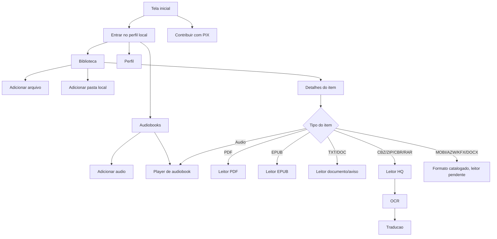

# Minha Estante

<div align="center">
  

  <p><strong>Biblioteca digital pessoal feita em Flutter para organizar, ler e ouvir arquivos locais.</strong></p>

  <p>
    
    
    
    
    
  </p>
</div>

## Visao Geral

O **Minha Estante** e um app de biblioteca pessoal. O app organiza arquivos do celular, salva progresso de leitura/audio e abre cada item no leitor ou player adequado.

O foco atual e Android. iOS, Web, Windows, macOS e Linux existem pela estrutura padrao do Flutter, mas os fluxos principais foram pensados e testados primeiro para Android.

## Estado Atual Da Analise

Analise executada em 2026-05-19:

- `flutter analyze` passou sem problemas.
- `flutter test` passou com 3 testes.
- `flutter build appbundle --release` passou e gerou um AAB de release.
- O app ja funciona como biblioteca local para desenvolvimento e testes.
- O AAB ainda nao esta pronto para publicacao real porque o release usa assinatura de debug.
- O fluxo visivel nao usa Google Drive, API do Google ou login online.
- Ainda existe codigo legado de Drive no repositorio; ele nao aparece na navegacao atual, mas deve ser removido ou isolado antes de uma versao publica limpa.

## Fluxo Atual Do App

1. O app abre na tela inicial.
2. A tela inicial mostra **Entrar** e **Contribuir com PIX**.
3. Ao tocar em **Entrar**, o usuario acessa um perfil local.
4. O app nao restaura sessao automaticamente ao reabrir. Se o app for fechado e nao houver reproducao em segundo plano, ele volta para a tela inicial.
5. A navegacao principal tem tres abas: **Biblioteca**, **Audiobooks** e **Perfil**.
6. **Biblioteca** mostra livros, documentos, HQs, mangas e audios adicionados.
7. **Audiobooks** mostra apenas itens de audio e permite adicionar novos arquivos de audio.
8. **Perfil** mostra estatisticas locais, privacidade, contribuicao via PIX, edicao local do nome e a opcao de voltar para a tela inicial.

## O Que Ja Foi Implementado

- Tela inicial local com botao **Entrar**.
- Botao **Contribuir com PIX** usando a chave `giovaneinescontato@gmail.com`.
- Perfil local sem cadastro, senha, backend ou autenticacao online.
- Biblioteca local com Hive.
- Importacao de arquivos avulsos.
- Importacao de pastas locais no Android via Storage Access Framework.
- Abas principais: Biblioteca, Audiobooks e Perfil.
- Tela de Privacidade dentro do app.
- Leitor de PDF.
- Leitor de EPUB.
- Leitor de TXT/documento simples.
- Leitor de HQ/Manga para CBZ/ZIP.
- Conversao parcial de CBR/RAR para CBZ.
- OCR em HQ/Manga com ML Kit.
- Traducao de texto reconhecido usando servico externo via HTTP.
- Player de audio/audiobook.
- Audio em segundo plano e tela bloqueada com notificacao de midia.
- Salvamento de progresso de audio.
- Suporte de audio para `mp3`, `m4a`, `m4b`, `aac`, `wav` e `opus`.
- Favoritos, status de leitura e progresso por item.
- Licenca MIT criada no arquivo `LICENSE`.

## Mapa Do Fluxo



## Formatos

| Formato | Entrada atual | Leitura/reproducao atual | Estado |
| --- | --- | --- | --- |
| PDF | Local | Sim | Leitor com progresso. TTS ainda pendente. |
| EPUB | Local | Sim | Leitor interno. TTS ainda pendente. |
| TXT | Local | Sim | Leitura simples. Bom candidato para primeiro TTS. |
| CBZ, ZIP | Local | Sim | Abre como HQ/Manga. |
| CBR, RAR | Local | Parcial | Tenta converter para CBZ. Pode falhar em RAR5, arquivo com senha ou arquivo grande. |
| CB7, CBT, CBA | Local/catalogacao | Limitado | Detectado em partes do app, mas ainda precisa extrator/conversor dedicado. |
| MOBI, AZW, AZW3 | Local/catalogacao | Nao | Precisa conversao para EPUB ou leitor dedicado. Nao prometer suporte a DRM. |
| KFX | Local/catalogacao | Nao | Deve continuar como nao suportado ate existir estrategia clara. |
| DOC, DOCX | Local/catalogacao | Parcial/nao | DOC/TXT abre como documento simples quando possivel; DOCX precisa leitor/conversor com fidelidade. |
| MP3, M4A, M4B, AAC, WAV, OPUS | Local | Sim/parcial | Player usa `just_audio`; suporte final depende do codec do aparelho. |
| Pasta de imagens | Pasta local | Nao consolidado | Melhor implementar como modo HQ por pasta, agrupando JPG/PNG/WebP. |

## Leitura E Audio

Hoje existem dois caminhos diferentes:

- **Ler:** usado para PDF, EPUB, TXT, documentos e HQs.
- **Ouvir:** usado para arquivos de audio/audiobook.

O botao **Ouvir** para livros de texto ainda nao deve ser tratado como pronto, porque falta TTS. Para virar recurso real, o app precisa extrair texto, separar em blocos pequenos, tocar com TTS, salvar progresso separado da leitura visual e lidar com segundo plano.

## O Que Falta Para Ouvir Livros Com TTS

1. Criar uma camada separada de TTS, sem misturar com o player de audiobook real.
2. Extrair texto por formato:
   - EPUB: texto por capitulo.
   - TXT: conteudo direto do arquivo.
   - PDF com texto: extracao por pagina.
   - PDF escaneado/HQ/Manga: OCR por pagina.
3. Normalizar o texto:
   - remover cabecalhos e rodapes repetidos;
   - preservar ordem correta;
   - separar frases e blocos curtos.
4. Integrar TTS local, por exemplo `flutter_tts`, para um MVP offline.
5. Salvar progresso de audio/TTS separado do progresso de leitura visual.
6. Criar tela **Ouvir livro** com play/pause, voltar/avancar, velocidade, voz, marcador e continuar de onde parou.
7. Testar segundo plano, tela bloqueada, fone Bluetooth, chamadas, pausas do sistema e notificacao de midia.

## Audiobooks

O app ja tem uma area de audiobooks. Ela permite adicionar audio local, listar audiobooks e continuar de onde parou.

O que ainda falta melhorar:

- Ler capitulos internos de M4B.
- Exibir duracao real antes de abrir o player.
- Criar fila de reproducao.
- Criar bookmarks.
- Separar progresso por capitulo.
- Melhorar busca/filtro por autor, titulo, duracao e status.
- Testar comportamento longo em segundo plano em aparelho real.

## Google Drive

O Google Drive foi removido do fluxo visivel. A decisao faz sentido para uma primeira publicacao porque reduz dependencia de API, OAuth, chaves, revisao de escopos e explicacoes de privacidade.

Estado atual:

- Nao existe aba de Drive na navegacao principal.
- Nao existe setup obrigatorio de Drive no fluxo atual.
- O perfil nao pede Drive.
- Codigo antigo de fontes/Drive ainda existe em `lib/features/sources`, `lib/core/utils/drive_link_parser.dart` e alguns textos legados.

Recomendacao para a proxima versao: remover o codigo legado de Drive de vez ou deixar totalmente isolado atras de uma flag interna. Para Play Store, quanto menos codigo e permissao sem uso, melhor.

## Login

O app nao tem login real. O fluxo atual e uma entrada local.

Isso e bom para a Play Store se o app for descrito como biblioteca local, porque evita exigencias de conta, recuperacao de senha, backend, exclusao de conta e politicas de autenticacao.

Se no futuro houver conta online, sincronizacao ou backup em nuvem, sera necessario implementar:

- login real;
- recuperacao de acesso;
- exclusao de conta;
- politica de privacidade publica;
- seguranca de API;
- criptografia e regras de retencao de dados.

## Play Store E Seguranca

Pontos que precisam ser resolvidos antes de publicar:

- **Assinatura real:** o release ainda usa assinatura de debug em `android/app/build.gradle.kts`. Gere uma upload key, configure `android/key.properties` local e ative Play App Signing.
- **Application ID:** confirme se `com.minhaestante.minha_estante` sera o pacote definitivo. Trocar depois de publicar significa criar outro app.
- **Target SDK:** em 2026-05-19, a exigencia atual do Google Play para novos apps e updates e Android 15/API 35 ou superior. Confirme o valor final gerado pelo Flutter antes de enviar.
- **Politica de privacidade publica:** a tela interna ajuda, mas a Play Store pede uma URL publica.
- **Data Safety:** declarar dados locais, arquivos escolhidos pelo usuario, texto enviado para traducao/OCR quando usado, e que nao ha conta online no fluxo atual.
- **Permissoes Android:** revisar se `READ_MEDIA_AUDIO` e realmente necessario quando o app usa seletor de arquivos/SAF. Reduzir permissao reduz risco de revisao.
- **Foreground service:** justificar uso de servico de midia para audiobook em segundo plano.
- **HTTPS:** manter `usesCleartextTraffic=false` e usar apenas servicos HTTPS em producao.
- **Segredos:** nunca commitar keystore, `key.properties`, tokens, API keys ou credenciais.
- **Testes em aparelho real:** validar importacao local, SAF, CBR/RAR, OCR, traducao, audio em segundo plano, tela bloqueada e notificacao.
- **Textos e encoding:** corrigir mojibake em arquivos do app antes da publicacao.

## Roadmap Da Proxima Versao

### Prioridade Alta

- Configurar assinatura release real.
- Criar e publicar politica de privacidade externa.
- Remover ou isolar totalmente o codigo legado de Drive.
- Corrigir textos com encoding quebrado.
- Revisar permissoes Android.
- Testar AAB em aparelho real via Play Console/Internal testing.
- Adicionar testes para deteccao de formatos, importacao local e classificacao de itens.

### Prioridade Media

- Melhorar area de audiobooks com duracao, capitulos M4B, bookmarks e fila.
- Melhorar notificacao de midia e retomada de audio.
- Extrair metadados de EPUB/PDF/audio: capa, autor, paginas, capitulos, duracao, codec e tamanho.
- Criar busca por titulo, autor, tipo, status e colecao.
- Implementar backup/exportacao local da biblioteca.
- Tratar pasta de imagens como HQ/Manga.

### Prioridade Baixa/Futura

- Botao **Ouvir** abaixo de **Ler** para EPUB/TXT/PDF quando TTS estiver implementado.
- MVP de TTS local primeiro para TXT e EPUB.
- TTS para PDF com texto.
- OCR + TTS para PDF escaneado, HQ e Manga.
- Leitor/conversor para MOBI/AZW/AZW3 sem DRM.
- Tratamento claro para KFX como formato nao suportado.
- Leitor/conversor confiavel para DOCX.
- Backup criptografado ou sincronizacao em nuvem, somente se houver politica de privacidade e seguranca prontas.

## Comandos De Desenvolvimento

Instalar dependencias:

```bash
flutter pub get
```

Rodar o app:

```bash
flutter run
```

Validar qualidade:

```bash
dart format .
flutter analyze
flutter test
flutter build appbundle --release
```

Gerar uma upload key para publicacao Android:

```bash
keytool -genkey -v -keystore "$env:USERPROFILE\upload-keystore.jks" -storetype JKS -keyalg RSA -keysize 2048 -validity 10000 -alias upload
```

Crie `android/key.properties` localmente e nao comite esse arquivo. O `.gitignore` ja bloqueia `android/key.properties`, `*.jks` e `*.keystore`.

## Principais Dependencias

| Pacote | Uso |
| --- | --- |
| `flutter_riverpod` | Estado global e controllers. |
| `go_router` | Rotas e navegacao. |
| `hive` / `hive_flutter` | Persistencia local. |
| `file_picker` | Selecao de arquivos e pastas quando aplicavel. |
| `pdfrx` | Renderizacao de PDF. |
| `flutter_epub_viewer` | Leitor EPUB. |
| `archive` / `rar` | Leitura/conversao de arquivos de HQ. |
| `google_mlkit_text_recognition` | OCR em paginas de HQ/Manga. |
| `http` | Chamadas externas, como traducao. |
| `just_audio` | Player de audio. |
| `just_audio_background` | Audio em segundo plano com notificacao. |
| `audio_service` | Servico de midia usado indiretamente pelo background audio. |
| `audio_session` | Sessao de audio e integracao com o sistema. |

## Referencias Tecnicas

- [Flutter: Build and release an Android app](https://docs.flutter.dev/deployment/android)
- [Google Play target API level requirement](https://developer.android.com/google/play/requirements/target-sdk)
- [Google Play Data safety](https://support.google.com/googleplay/android-developer/answer/10787469)
- [Google Play User Data policy](https://support.google.com/googleplay/android-developer/answer/10144311)
- [Google Play account deletion requirements](https://support.google.com/googleplay/android-developer/answer/13327111)
- [Android cleartext communications](https://developer.android.com/privacy-and-security/risks/cleartext-communications)
- [Android Storage Access Framework](https://developer.android.com/guide/topics/providers/document-provider)
- [audio_service no pub.dev](https://pub.dev/packages/audio_service)
- [audio_session no pub.dev](https://pub.dev/packages/audio_session)

## Licenca

Este projeto esta licenciado sob a licenca MIT. Veja [LICENSE](LICENSE).
